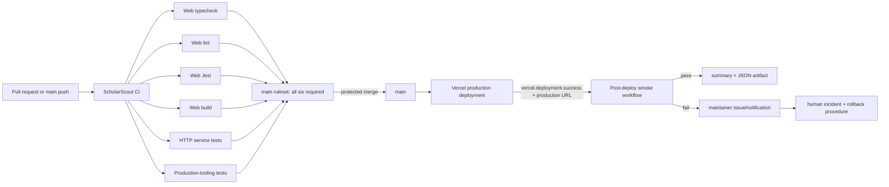

# Phase 1: Release and CI Baseline - Research

**Researched:** 2026-07-25  
**Domain:** pnpm workspace migration, GitHub Actions quality gates, Vercel Git deployment verification  
**Confidence:** MEDIUM

<user_constraints>
## User Constraints (from CONTEXT.md)

### Locked Decisions
- **D-01:** Migrate Scholar Scout to pnpm in Phase 1; npm is no longer a supported installation path after the migration.
- **D-02:** Pin the pnpm version through the root `packageManager` field and enable Corepack so local development, CI, and Vercel use the same version.
- **D-03:** Keep one authoritative root `pnpm-lock.yaml`; remove the root `package-lock.json` and `apps/web/pnpm-lock.yaml`.
- **D-04:** Regenerate and review the root lockfile from the declared workspace manifests rather than adopting the existing untracked lockfile.
- **D-05:** Require frozen-lockfile installs locally, in CI, and on Vercel. Local pnpm caches are ignored, never committed, and are not deleted automatically.
- **D-06:** Every pull request runs the full relevant suite: web build, typecheck, lint, Jest tests, HTTP data-service tests, and production-tooling tests.
- **D-07:** Expose checks as separate named CI jobs so each failure is independently visible and unaffected checks can run concurrently.
- **D-08:** Treat build/typecheck/test failures and every lint warning as merge-blocking.
- **D-09:** Run the same quality checks on pull requests and pushes to `main`.
- **D-10:** Protect `main` with GitHub branch protection or rulesets requiring the named CI checks before merge.
- **D-11:** Trigger production deployment only after a successful protected merge to `main`.
- **D-12:** Run automated smoke checks after every production deployment.
- **D-13:** A failed post-deploy smoke check alerts maintainers and follows a documented human rollback procedure; do not auto-rollback while compatible data changes are still evolving.
- **D-14:** Make the pnpm migration atomic: update package metadata, CI workflows, Vercel configuration, development/deployment documentation, and `.gitignore` together; remove obsolete npm references and stale lockfiles in the same change.

### the agent's Discretion

No decisions were delegated. Planners may choose the exact pnpm version compatible with Node 20 and the exact CI job topology, provided all locked guarantees above hold.

### Deferred Ideas (OUT OF SCOPE)

None — discussion stayed within Phase 1 scope.
</user_constraints>

<phase_requirements>
## Phase Requirements

| ID | Description | Research Support |
|----|-------------|------------------|
| OPS-01 | Every pull request receives a relevant Scholar Scout build, typecheck, lint, and test result; no unrelated CrimClock job can fail the pipeline. | Six explicit, independently named Scholar Scout CI jobs; delete the CrimClock job; require these exact check names in the `main` ruleset. |
| OPS-05 | The repository has one documented, immutable package-manager and lockfile path for local development, CI, and deployment. | Pin pnpm through Corepack, add the workspace manifest, regenerate a single root lockfile, and use frozen installs in local instructions, all workflows, and Vercel. |
</phase_requirements>

## Project Constraints (from AGENTS.md)

- Retain the Next.js 15, React 18, TypeScript, NextAuth, and Vercel foundation; Phase 1 changes delivery tooling only and must not introduce platform churn. [VERIFIED: `AGENTS.md`]
- Preserve in-progress feature work: inspect the dirty worktree and keep this atomic operational migration isolated from unrelated product changes. [VERIFIED: `AGENTS.md`]
- Do not risk production data; this phase must not modify persistence adapters, whole-document data, or deployment data migration behavior. [VERIFIED: `AGENTS.md`]
- CI must become a reliable quality gate before release decisions depend on it; all required web checks use strict TypeScript and ESLint's existing `--max-warnings=0` lint contract. [VERIFIED: `AGENTS.md`, `apps/web/package.json`]
- Keep Node 20 as the declared runtime for this phase and use root workspace commands; no Docker dependency is required for the supported deployment path. [VERIFIED: `AGENTS.md`]
- Preserve the established two-space/single-quote TypeScript convention if a small workflow-support script becomes necessary; use existing scripts and route nothing through browser code. [VERIFIED: `AGENTS.md`]
- Do not make direct repository edits outside the GSD phase workflow. This research artifact is the sole file owned by this agent. [VERIFIED: `AGENTS.md`]

## Summary

Scholar Scout currently declares npm 10 workspaces in the root manifest and uses `npm ci`/`npm install` throughout CI, deployment configuration, scripts, docs, and portable Windows helpers. The primary CI workflow contains a second `CrimClock quality gate` that references absent `@crimclock/web` and `services/api` paths, so it cannot serve as a Scholar Scout release signal. [VERIFIED: codebase grep and `.github/workflows/ci.yml`]

The repository already has the operational building blocks required after deployment: `scripts/production-smoke.mjs` validates public routes, auth providers, denied admin routes, durable-data health, expected adapter, retention, and optional latency; `production-monitor.yml` retains JSON evidence; and the incident runbook specifies a human rollback after a known-good deployment is identified. The missing link is an event-driven smoke workflow for each successful **production** Vercel deployment, plus a maintainer alert and documented GitHub/Vercel settings. [VERIFIED: `scripts/production-smoke.mjs`, `.github/workflows/production-monitor.yml`, and `docs/production-incident-response.md`]

The root `pnpm-lock.yaml` must be discarded rather than adopted: it contains only the root importer and resolves `typescript@7.0.2` / `@types/node@26.1.1`, while the independent `apps/web/pnpm-lock.yaml` resolves the web package. Neither is a single lockfile for all declared workspaces. pnpm workspaces require a root `pnpm-workspace.yaml`, and the default shared workspace lockfile model produces one root `pnpm-lock.yaml`. [VERIFIED: current lockfiles and manifests] [CITED: https://pnpm.io/workspaces]

**Primary recommendation:** Make one atomic pnpm 10 workspace migration, then replace `ci.yml` with six fixed-name Scholar Scout jobs and add a `repository_dispatch` post-production-smoke workflow driven by Vercel's Git integration.

## Architectural Responsibility Map

| Capability | Primary Tier | Secondary Tier | Rationale |
|------------|-------------|----------------|-----------|
| Dependency resolution and immutable install | Developer/CI build environment | Vercel build environment | The root workspace metadata and lockfile determine the dependency graph before any app code runs. [VERIFIED: root `package.json`, `vercel.json`] |
| PR quality signal | GitHub Actions | GitHub ruleset/branch protection | Jobs emit named check runs; GitHub separately decides whether those names block merges. [CITED: https://docs.github.com/en/repositories/configuring-branches-and-merges-in-your-repository/managing-protected-branches/about-protected-branches] |
| Production deployment | Vercel Git integration | GitHub protected `main` branch | Vercel creates production deployments from merges to the configured production branch; protection must prevent unvalidated direct merges. [CITED: https://vercel.com/docs/git] |
| Post-deploy smoke and alert | GitHub Actions | Vercel deployment event / GitHub Issues | Vercel supplies the production deployment URL; Actions invokes the existing smoke script and records/alerts on failure. [CITED: https://vercel.com/docs/git/vercel-for-github] |
| Rollback | Vercel deployment operator | Incident runbook | A maintainer chooses and promotes/reverts to a known-good deployment only after the data-safe incident checks; Phase 1 must not automate this. [VERIFIED: `docs/production-incident-response.md`] |

## Standard Stack

### Core

| Library / Service | Version | Purpose | Why Standard |
|-------------------|---------|---------|--------------|
| `pnpm` | `10.34.5` | Sole workspace package manager and lockfile producer | The current `latest-10` registry tag is `10.34.5`; pnpm 11 drops Node 20 support, so v10 is the compatible, pinned major for this Node 20 project. Reconfirm the exact patch when executing because the available local Node runtime is absent. [CITED: https://www.npmjs.com/package/pnpm?activeTab=versions] [CITED: https://github.com/orgs/pnpm/discussions/11377] |
| Corepack | Node 20 bundled tool | Activates the root `packageManager` pin for local and CI installs | Vercel's documented Corepack path uses the root `packageManager` value; the project must also set `ENABLE_EXPERIMENTAL_COREPACK=1` in Vercel. [CITED: https://vercel.com/docs/builds/configure-a-build] |
| GitHub Actions | existing hosted service | PR/push quality jobs and post-deployment smoke job | Existing workflows and check artifacts already use this service. [VERIFIED: `.github/workflows/*.yml`] |
| Vercel Git integration | existing hosting path | Deploy `main`, emit production success event to GitHub | Vercel documents `vercel.deployment.success` `repository_dispatch` events with URL/environment payload. [CITED: https://vercel.com/docs/git/vercel-for-github] |

### Supporting

| Existing asset | Purpose | When to Use |
|----------------|---------|-------------|
| `scripts/production-smoke.mjs` | Deterministic production route/data-health smoke suite with `--json` output | Run after every Vercel production success and on the existing six-hour monitor. [VERIFIED: `scripts/production-smoke.mjs`] |
| `scripts/test-production-tooling.mjs` | Node built-in tests for readiness, smoke, reports, and provisioning scripts | A dedicated CI job required for every PR/push. [VERIFIED: `scripts/test-production-tooling.mjs`] |
| `services/http-data-service/test` | Node built-in contract tests for the HTTP persistence fixture | A dedicated CI job required for every PR/push. [VERIFIED: `services/http-data-service/package.json`] |
| `docs/production-incident-response.md` | Data-safe, human rollback procedure | Link it from the smoke-failure alert and release runbook. [VERIFIED: `docs/production-incident-response.md`] |

### Alternatives Considered

| Instead of | Could Use | Tradeoff |
|------------|-----------|----------|
| Vercel `repository_dispatch` event | `deployment_status` trigger | Vercel recommends `repository_dispatch`; it carries deployment URL/environment and can subscribe only to success, avoiding status filtering/noise. [CITED: https://vercel.com/docs/git/vercel-for-github] |
| Six separate quality jobs | One monolithic job | A single job hides which required behavior failed and prevents unaffected checks from completing concurrently; it conflicts with D-07. [VERIFIED: locked D-07 in `01-CONTEXT.md`] |

**Installation and invocation contract:**

```bash
corepack enable
pnpm install --frozen-lockfile --ignore-scripts
pnpm --filter @scholar-scout/web typecheck
pnpm --filter @scholar-scout/web lint
pnpm --filter @scholar-scout/web test -- --runInBand
pnpm --filter @scholar-scout/web build
pnpm --filter @scholar-scout/http-data-service test
pnpm test:production-tooling
```

`--frozen-lockfile` must remain explicit even though pnpm enables it by default in CI: it fails when the lockfile is missing or out of sync and makes the local/Vercel contract equally visible. `--ignore-scripts` preserves the current deployment safety posture; remove it only through a future explicitly reviewed dependency/build change. [CITED: https://pnpm.io/cli/install] [VERIFIED: current `vercel.json` and production workflows]

## Package Legitimacy Audit

No new application dependency is proposed for `package.json`. pnpm is activated by Corepack as the project tool rather than added as a runtime/development dependency, so no application package installation is authorized by this phase. The chosen pnpm pin is sourced from the pnpm package's `latest-10` registry tag, but the GSD package-legitimacy command could not run because `node` is unavailable in this environment. [CITED: https://www.npmjs.com/package/pnpm?activeTab=versions] [VERIFIED: local environment probe]

**Packages removed due to [SLOP] verdict:** none.  
**Packages flagged as suspicious [SUS]:** none.

## Architecture Patterns

### System Architecture Diagram



The diagram uses Vercel's documented `repository_dispatch` success event rather than polling or an additional deploy system. The post-deploy workflow must consume only the production event and pass its URL through the existing `SCHOLARSCOUT_SMOKE_BASE_URL` environment variable. [CITED: https://vercel.com/docs/git/vercel-for-github] [VERIFIED: `scripts/production-smoke.mjs`]

### Recommended Project Structure

```text
.
├── package.json                    # pnpm@10.34.5 pin, engines, pnpm-based root scripts
├── pnpm-workspace.yaml             # apps/*, packages/*, services/* workspace membership
├── pnpm-lock.yaml                  # only committed dependency lockfile
├── .github/workflows/
│   ├── ci.yml                      # six protected PR/main quality checks
│   ├── post-deploy-smoke.yml       # Vercel production-success smoke and alert
│   ├── production-monitor.yml      # six-hour recurring smoke remains in place
│   └── production-readiness.yml    # manual preflight remains in place
├── scripts/
│   ├── production-smoke.mjs        # reused, not duplicated
│   └── pnpm-portable.ps1/.cmd      # renamed/reworked portable Windows entry point
└── docs/                           # one pnpm installation/deployment/release vocabulary
```

### Pattern 1: Single-root pnpm workspace

**What:** Add `pnpm-workspace.yaml` with the existing workspace globs, set the root `packageManager` to the exact pnpm v10 pin, translate root script calls to `pnpm --filter`, and generate the lockfile once from every workspace manifest.

**When to use:** Always for repository-root installs, local development, Actions, and Vercel. pnpm requires `pnpm-workspace.yaml` at the root; its shared lockfile setting defaults to a single root lockfile. [CITED: https://pnpm.io/workspaces]

**Required migration sequence:**

1. Preserve the dirty product-feature work; inspect `git status` and do not stage/absorb unrelated files. [VERIFIED: `PROJECT.md` delivery constraint]
2. Add `pnpm-workspace.yaml` containing the current root workspace patterns (`apps/*`, `packages/*`, `services/*`). [VERIFIED: root `package.json`] [CITED: https://pnpm.io/workspaces]
3. Update root/service engine metadata and root scripts to pnpm only; `pnpm --filter @scholar-scout/web …` replaces every `npm run … --workspace …` invocation. Keep application scripts unchanged. [VERIFIED: root and service `package.json` files]
4. Enable Corepack, regenerate the root lockfile from manifests with the pinned pnpm, review all importers/resolutions, then run a frozen install. Do **not** copy either present lockfile forward. [VERIFIED: current lockfile contents] [CITED: https://pnpm.io/cli/install]
5. Remove `package-lock.json` and `apps/web/pnpm-lock.yaml` only in the same committed migration after the new root lockfile contains root, web, HTTP-service, and webhook-runner importers. [VERIFIED: locked D-03/D-04]
6. Update every operational workflow, Vercel command, portable helper, PR template, and documentation command in the same change; leave `.pnpm-store/` ignored and do not delete local caches. [VERIFIED: locked D-05/D-14 and `.gitignore`]

### Pattern 2: Independent CI checks with fixed names

**What:** `ci.yml` contains six jobs that share a setup sequence but have stable job `name` values. Each job calls `corepack enable`, performs `pnpm install --frozen-lockfile --ignore-scripts`, then runs exactly one behavior.

| Job id | Required displayed name | Command |
|--------|-------------------------|---------|
| `web-typecheck` | `ScholarScout / Web typecheck` | `pnpm --filter @scholar-scout/web typecheck` |
| `web-lint` | `ScholarScout / Web lint` | `pnpm --filter @scholar-scout/web lint` |
| `web-jest` | `ScholarScout / Web Jest` | `pnpm --filter @scholar-scout/web test -- --runInBand` |
| `web-build` | `ScholarScout / Web build` | `pnpm --filter @scholar-scout/web build` |
| `http-data-service-tests` | `ScholarScout / HTTP data-service tests` | `pnpm --filter @scholar-scout/http-data-service test` |
| `production-tooling-tests` | `ScholarScout / Production-tooling tests` | `pnpm test:production-tooling` |

Use `actions/setup-node` with Node 20 and `cache: pnpm` only after Corepack/pnpm is available, or omit caching entirely; pnpm documents caching as optional. Cache only the pnpm store, never `node_modules`, credentials, or generated app state. [CITED: https://pnpm.io/continuous-integration] [CITED: https://docs.github.com/en/actions/reference/workflows-and-actions/dependency-caching]

**Branch gate design:** Configure the external `main` ruleset/branch-protection rule after these names have appeared in a successful run. Require all six names from the GitHub Actions app, require branches to be up to date, require pull requests, prevent direct pushes, and do not require a generic aggregate job. GitHub says a required check must have completed successfully in the repository in the previous seven days before it can be selected, and duplicate status/check names can accidentally require both. [CITED: https://docs.github.com/en/pull-requests/collaborating-with-pull-requests/collaborating-on-repositories-with-code-quality-features/troubleshooting-required-status-checks] [CITED: https://docs.github.com/en/repositories/configuring-branches-and-merges-in-your-repository/managing-protected-branches/about-protected-branches]

### Pattern 3: Vercel success event to post-deploy smoke

**What:** Add `.github/workflows/post-deploy-smoke.yml`:

```yaml
name: ScholarScout Post-deploy Smoke

on:
  repository_dispatch:
    types: [vercel.deployment.success]

jobs:
  production-smoke:
    if: github.event.client_payload.environment == 'production'
    name: ScholarScout / Post-deploy production smoke
    runs-on: ubuntu-latest
    permissions:
      contents: read
    env:
      SCHOLARSCOUT_SMOKE_BASE_URL: ${{ github.event.client_payload.url }}
      SCHOLARSCOUT_SMOKE_HEALTH_TOKEN: ${{ secrets.SCHOLARSCOUT_SMOKE_HEALTH_TOKEN }}
      SCHOLARSCOUT_SMOKE_EXPECTED_ADAPTER: ${{ secrets.SCHOLARSCOUT_SMOKE_EXPECTED_ADAPTER }}
      SCHOLARSCOUT_SMOKE_EXPECTED_PROVIDERS: ${{ secrets.SCHOLARSCOUT_SMOKE_EXPECTED_PROVIDERS }}
    steps:
      - uses: actions/checkout@v4
      - uses: actions/setup-node@v4
        with:
          node-version: 20
      - run: corepack enable
      - run: pnpm install --frozen-lockfile --ignore-scripts
      - run: pnpm smoke:production
      - if: always()
        run: pnpm smoke:production -- --json > production-smoke-report.json
      - if: always()
        run: pnpm report:production -- --smoke-report production-smoke-report.json >> "$GITHUB_STEP_SUMMARY"
```

Add a second `if: failure()` alert job with the smallest necessary `issues: write` permission. It should create (or update) a clearly titled incident issue containing the deployment URL, commit SHA, failing workflow run, report artifact link, and `docs/production-incident-response.md` URL—never a secret, cookie, or exported data. This is the durable maintainer alert; GitHub notification preferences alone are not a guaranteed team alerting mechanism. [CITED: https://vercel.com/docs/git/vercel-for-github] [VERIFIED: existing smoke report deliberately omits secret values and incident runbook safety rules]

Vercel must remain Git-connected with `main` as production branch. Its Git integration creates production deployments on production-branch merges and sends the documented dispatch event only if the workflow resides on the default branch. Configure Vercel project variable `ENABLE_EXPERIMENTAL_COREPACK=1`, retain repository root as Vercel Root Directory, and set `vercel.json` `installCommand` to `pnpm install --frozen-lockfile --ignore-scripts` and `buildCommand` to `pnpm build:vercel`. [CITED: https://vercel.com/docs/git] [CITED: https://vercel.com/docs/builds/configure-a-build] [CITED: https://vercel.com/docs/package-managers]

### Anti-Patterns to Avoid

- **Adopting either existing pnpm lockfile:** They are not the workspace graph described by root manifests; regenerate a reviewed root lockfile instead. [VERIFIED: `pnpm-lock.yaml`, `apps/web/pnpm-lock.yaml`, locked D-04]
- **Using plain `pnpm install` in Vercel or local docs:** This permits lockfile mutation outside CI and violates D-05; use the frozen command everywhere. [VERIFIED: locked D-05] [CITED: https://pnpm.io/cli/install]
- **Keeping `CrimClock quality gate` or collapsing all Scholar Scout checks:** The former references another product; the latter fails independent visibility/concurrency. [VERIFIED: `.github/workflows/ci.yml`, locked D-06/D-07]
- **Triggering smoke on every preview:** Filter to Vercel's production environment; previews have different credentials/data and would create false alerts. [CITED: https://vercel.com/docs/git/vercel-for-github]
- **Automatic rollback:** Keep data-safe human review and snapshot guidance as the release failure response. [VERIFIED: locked D-13 and `docs/production-incident-response.md`]

## Don't Hand-Roll

| Problem | Don't Build | Use Instead | Why |
|---------|-------------|-------------|-----|
| Workspace dependency graph | Custom per-workspace install scripts or copied locks | pnpm workspace + one generated root lockfile | pnpm owns importer resolution and shared-lockfile semantics. [CITED: https://pnpm.io/workspaces] |
| Package-manager version selection | Repository scripts that download/guess a pnpm binary | Corepack + exact root `packageManager` pin | Vercel documents this as its supported version-pinning path. [CITED: https://vercel.com/docs/builds/configure-a-build] |
| Deployment-completion polling | A custom Vercel REST polling service | Vercel Git integration `repository_dispatch` | The event includes deployment URL/environment and is designed for dependent Actions workflows. [CITED: https://vercel.com/docs/git/vercel-for-github] |
| New smoke probe suite | Duplicate `curl` scripts | Existing `scripts/production-smoke.mjs` and report formatter | It already asserts public, auth, authorization, durable-data, retention, and latency behaviors. [VERIFIED: `scripts/production-smoke.mjs`] |
| Rollback automation | State-blind automatic deployment reversal | Existing human incident/rollback runbook | Data changes are still evolving; D-13 expressly forbids auto-rollback. [VERIFIED: locked D-13] |

**Key insight:** release confidence comes from a single committed graph plus independently observable checks; neither a cache nor a Vercel preview is a substitute for an immutable install and a protected merge gate.

## Common Pitfalls

### Pitfall 1: A root pnpm command silently excludes workspace packages

**What goes wrong:** A root lockfile can be generated without the actual web/service importers if `pnpm-workspace.yaml` is absent.  
**Why it happens:** pnpm workspaces require that root file; npm's `workspaces` field alone is not the pnpm workspace definition. [CITED: https://pnpm.io/workspaces]  
**How to avoid:** Add the YAML manifest before generating the replacement lockfile and review `importers:` for `.`, `apps/web`, both services, and any future matching package directory.  
**Warning signs:** A lockfile importer list contains only `.` or `pnpm --filter @scholar-scout/web …` cannot find the workspace. [VERIFIED: current root `pnpm-lock.yaml`]

### Pitfall 2: Corepack pin and lockfile major disagree

**What goes wrong:** Vercel/CI use a different pnpm major than the lockfile writer and frozen installs fail.  
**Why it happens:** pnpm CI rejects lockfiles that need updates; newer pnpm also rejects lockfiles created by incompatible newer majors. [CITED: https://pnpm.io/continuous-integration]  
**How to avoid:** Pin `pnpm@10.34.5`, regenerate the lockfile with that pin, set Vercel's Corepack variable, and verify the selected pnpm version in both Actions and Vercel logs.  
**Warning signs:** `ERR_PNPM_OUTDATED_LOCKFILE`, incompatible lockfile errors, or Vercel logs selecting a different pnpm major. [CITED: https://vercel.com/docs/package-managers]

### Pitfall 3: A required status check is never reported

**What goes wrong:** A PR remains pending even though code is valid.  
**Why it happens:** required checks require stable names and GitHub leaves a workflow skipped by branch/path filtering pending. [CITED: https://docs.github.com/en/pull-requests/collaborating-with-pull-requests/collaborating-on-repositories-with-code-quality-features/troubleshooting-required-status-checks]  
**How to avoid:** Do not path-filter the required CI workflow; run all six jobs on every PR and push to `main`, then require exactly their displayed names.  
**Warning signs:** ruleset UI shows duplicate/ambiguous names or a PR says “Waiting for status to be reported.”

### Pitfall 4: Smoke execution targets a preview or wrong production URL

**What goes wrong:** A successful preview masks a broken production deployment, or a preview causes a false production alert.  
**Why it happens:** Vercel Git integration sends deployment events for multiple environments. [CITED: https://vercel.com/docs/git/vercel-for-github]  
**How to avoid:** subscribe to `vercel.deployment.success`, filter `client_payload.environment == 'production'`, and use the event payload URL rather than a static base URL.  
**Warning signs:** smoke report URLs do not match the promoted production deployment.

### Pitfall 5: Silent maintainer-alert failure

**What goes wrong:** The smoke job fails but no actionable incident reaches the team.  
**Why it happens:** artifact upload and workflow failure alone do not guarantee a shared alert channel.  
**How to avoid:** make the failure alert a separate job with `issues: write`, verify it once with an intentional failing smoke endpoint, and link the human rollback runbook. [ASSUMED]

## State of the Art

| Old Approach | Current Approach | When Changed | Impact |
|--------------|------------------|--------------|--------|
| npm root lock plus nested pnpm lock | One pnpm workspace lockfile with Corepack pin | Phase 1 | Removes ambiguous resolver inputs and makes frozen installs meaningful. [VERIFIED: locked D-01 to D-05] |
| Vercel `deployment_status` listener | Vercel `repository_dispatch` `vercel.deployment.success` | Current Vercel Git guidance | Event filters directly on success and exposes richer client payload fields. [CITED: https://vercel.com/docs/git/vercel-for-github] |
| Manual/scheduled production smoke only | Event-driven smoke after every production deployment plus existing scheduled monitor | Phase 1 | Closes the release-to-verification gap while retaining ongoing health checks. [VERIFIED: existing `production-monitor.yml`, locked D-12] |

**Deprecated/outdated:**

- The npm installation/documentation path is obsolete after this migration; remove its root lockfile, commands, portable wrappers, CI cache mode, and user-facing instructions in the same atomic change. [VERIFIED: locked D-01/D-03/D-14]
- Node 20 reached end of life on 2026-03-24. Preserve it in this phase because the project explicitly retains Node 20, but record a follow-up runtime upgrade before relying on this baseline for long-lived production security. [CITED: https://nodejs.org/en/about/previous-releases]

## File-Level Implementation Recommendations

| File | Required change |
|------|-----------------|
| `package.json` | Change `packageManager` to `pnpm@10.34.5`; replace npm engine with exact pnpm engine/pin-compatible metadata; translate all root scripts, including `vercel:docker-free`, to pnpm. [VERIFIED: current root manifest] |
| `pnpm-workspace.yaml` | Add root workspace globs for `apps/*`, `packages/*`, and `services/*`; no custom hoisting settings are justified. [VERIFIED: root manifest] [CITED: https://pnpm.io/workspaces] |
| `pnpm-lock.yaml` | Replace with a clean, reviewed, root-generated workspace lockfile; ensure every workspace importer appears. [VERIFIED: current lockfiles, locked D-03/D-04] |
| `package-lock.json`, `apps/web/pnpm-lock.yaml` | Delete in the atomic migration only after validation succeeds. [VERIFIED: locked D-03] |
| `.github/workflows/ci.yml` | Delete CrimClock job and implement six named Scholar Scout jobs for PR and `main` push. [VERIFIED: current workflow, locked D-06 through D-09] |
| `.github/workflows/post-deploy-smoke.yml` | Add dispatch-driven production smoke, JSON report/artifact, and failure alert job. [CITED: https://vercel.com/docs/git/vercel-for-github] |
| `production-readiness.yml`, `production-monitor.yml`, `prelaunch-rehearsal.yml`, `product-ops.yml`, `autonomous-product-manager.yml` | Change setup/cache/install/run calls from npm to Corepack/pnpm frozen-install equivalents; retain their existing purpose and permissions. [VERIFIED: current workflows] |
| `vercel.json` | Use `pnpm install --frozen-lockfile --ignore-scripts` and `pnpm build:vercel`; retain root build/output structure. [VERIFIED: current Vercel config] [CITED: https://vercel.com/docs/package-managers] |
| `scripts/npm-portable.ps1`, `scripts/npm-portable.cmd`, `scripts/use-portable-node.ps1` | Replace or rename as pnpm/Corepack portable helpers; preserve only the portable Node mechanism and set an ignored pnpm store/cache path. [VERIFIED: current helper contents] |
| `services/codex-webhook-runner/package.json` | Replace npm engine declaration with the chosen pnpm engine or remove package-manager-specific subpackage engine metadata so the root pin is authoritative. [VERIFIED: service manifest] |
| `.github/PULL_REQUEST_TEMPLATE.md` and all npm-command docs | Replace command examples with their pnpm equivalents, including `docs/vercel-deployment.md`, `docker-free-development.md`, release/incident/readiness docs, HTTP adapter runbook, Blob adapter guide, OAuth handoffs, and Vercel workaround/permissions docs. [VERIFIED: codebase grep] |
| `.gitignore` | Keep `.pnpm-store/`; add only the exact local cache path introduced by the portable helper if it is outside that existing ignored directory. Never commit/remove caches automatically. [VERIFIED: `.gitignore`, locked D-05] |

## Environment Availability

| Dependency | Required By | Available | Version | Fallback |
|------------|-------------|-----------|---------|----------|
| Node.js | Lockfile generation and all validation commands | ✗ | — | Repo portable Node helper exists but needs a local `.tools/node-v20.20.2-win-x64` installation. [VERIFIED: environment probe and `scripts/use-portable-node.ps1`] |
| npm | Current portable bootstrap only | ✗ | — | It is not a supported project path after Phase 1; use Corepack-enabled pnpm. [VERIFIED: environment probe, locked D-01] |
| Corepack/pnpm | Lockfile regeneration and frozen install | ✗ | — | Activate from the supported Node 20 runtime; no alternate package manager is permitted. [VERIFIED: environment probe, locked D-01/D-02] |
| GitHub Actions | CI and post-deploy smoke | Not locally probeable | — | Validate through a draft PR/main test commit after workflow changes. [ASSUMED] |
| Vercel Git integration | Production deploy and `repository_dispatch` event | Not locally probeable | — | Verify in Vercel project settings/build logs and with a controlled production deployment. [CITED: https://vercel.com/docs/git/vercel-for-github] |

**Missing dependencies with no fallback:** Node 20/Corepack/pnpm are required to regenerate and validate the lockfile. Do not claim local validation until the portable runtime has been provisioned and `node --version`, `corepack --version`, and `pnpm --version` succeed. [VERIFIED: environment probe]

## Validation Architecture

### Test Framework

| Property | Value |
|----------|-------|
| Framework | Jest 30 for web; Node built-in test runner for HTTP service and production tooling. [VERIFIED: `apps/web/package.json`, service manifest, root manifest] |
| Config file | `apps/web/jest.config.ts`; Node test invocation is package scripts. [VERIFIED: `apps/web/package.json`] |
| Quick run command | `pnpm --filter @scholar-scout/web test -- --runInBand` |
| Full suite command | Run all six commands in the Standard Stack invocation contract. |

### Phase Requirements → Test Map

| Req ID | Behavior | Test Type | Automated Command | File Exists? |
|--------|----------|-----------|-------------------|-------------|
| OPS-01 | Each web quality behavior is independently visible and fails CI | CI integration/manual ruleset check | Trigger PR; inspect six named checks and force a lint/test failure in a temporary branch | ❌ Wave 0 workflow test |
| OPS-01 | HTTP fixture and production tooling are included | Node tests in separate CI jobs | `pnpm --filter @scholar-scout/http-data-service test`; `pnpm test:production-tooling` | ✅ |
| OPS-05 | A clean frozen install accepts the generated root lockfile | Install/integration | `pnpm install --frozen-lockfile --ignore-scripts` from a clean `node_modules` state | ❌ Wave 0 command evidence |
| OPS-05 | Vercel uses pinned pnpm and frozen root install | Deployment smoke/manual platform check | Inspect Vercel build log after merge for pinned pnpm/version and frozen command | ❌ external configuration evidence |
| OPS-01 | Successful production deployment runs smoke and failure alerts | GitHub/Vercel integration | Controlled `vercel.deployment.success` production event; inspect report artifact and alert path | ❌ external integration evidence |

### Sampling Rate

- **Per task commit:** frozen install plus the relevant changed command(s).
- **Per wave merge:** all six named quality commands.
- **Phase gate:** clean frozen install, full six-command suite, PR check-name inspection, protected-main ruleset inspection, Vercel production deployment log inspection, and one post-deploy smoke run with report artifact.

### Wave 0 Gaps

- [ ] A portable Node 20/Corepack setup capable of producing the reviewed root lockfile and executing validation.
- [ ] The new `post-deploy-smoke.yml` event path and a controlled Vercel production-success verification.
- [ ] External evidence (screenshot/export/run URL) that `main` requires exactly the six named Actions checks and blocks direct merge/push.
- [ ] A controlled smoke failure proving the alert issue contains no secret data and points to human rollback guidance.

## Security Domain

### Applicable ASVS Categories

| ASVS Category | Applies | Standard Control |
|---------------|---------|-----------------|
| V2 Authentication | No direct user-auth feature | Do not alter NextAuth authentication in this phase. [VERIFIED: phase boundary] |
| V3 Session Management | Indirectly | Do not log `SCHOLARSCOUT_SMOKE_STAFF_COOKIE`; prefer the existing health token for automated monitoring. [VERIFIED: `docs/production-release-runbook.md`] |
| V4 Access Control | Yes | Restrict GitHub workflow permissions; only failure-alert job receives `issues: write`, while smoke uses `contents: read`. [ASSUMED] |
| V5 Input Validation | Yes | Filter Vercel event to `production`, use the event URL only as an environment value, and preserve the smoke script's safe HTTP request/error reporting. [CITED: https://vercel.com/docs/git/vercel-for-github] [VERIFIED: `scripts/production-smoke.mjs`] |
| V6 Cryptography | Indirectly | Do not add custom signing/encryption; Vercel/GitHub integration and existing health-token handling remain the boundaries. [VERIFIED: phase boundary and current scripts] |

### Known Threat Patterns for This Stack

| Pattern | STRIDE | Standard Mitigation |
|---------|--------|---------------------|
| Mutable/deceptive dependency graph | Tampering | Single reviewed root lockfile and explicit frozen install in every execution environment. [CITED: https://pnpm.io/cli/install] |
| CI cache poisoning or secret disclosure | Tampering / Information disclosure | Cache only pnpm store; never cache secrets or `node_modules`; do not permit untrusted jobs to populate trusted caches. [CITED: https://pnpm.io/continuous-integration] [CITED: https://docs.github.com/en/actions/reference/workflows-and-actions/dependency-caching] |
| Preview deployment event triggering privileged production smoke | Elevation of privilege | Subscribe only to success and guard job with production environment condition. [CITED: https://vercel.com/docs/git/vercel-for-github] |
| Automated rollback overwriting evolving compatible data | Tampering / Availability | Alert and require documented human incident/rollback handling. [VERIFIED: locked D-13] |

## Assumptions Log

| # | Claim | Section | Risk if Wrong |
|---|-------|---------|---------------|
| A1 | An idempotent GitHub issue is the required Phase 1 durable maintainer alert channel. | Resolved Phase 1 Handling R1 | Plan 03 requires a controlled smoke-failure run and incident issue evidence; a supplementary channel does not replace the required issue evidence. |
| A2 | GitHub Actions/Vercel settings are accessible to a maintainer for external configuration validation. | Environment Availability | Repository changes alone would not make `main` protected or enable the deployment event. |

## Resolved Phase 1 Handling

1. **R1 — Maintainer alert channel: resolved to an idempotent GitHub issue.**
   - Phase 1's required alert is the non-secret GitHub issue created or updated by the failed-smoke alert job. This is a durable repository-owned artifact, so no Slack, Teams, email, or external webhook endpoint is needed to satisfy D-13.
   - Plan 03 Task 2 implements this channel and its acceptance criteria require controlled-failure evidence: workflow run, report artifact, alert issue, and maintainer acknowledgement of the linked human rollback procedure. `01-VALIDATION.md` makes that evidence a phase gate.
   - A maintainer may separately configure another notification channel later, but it is not a substitute for the required incident issue and is outside this phase's repository scope. **Status: RESOLVED.**

2. **R2 — Node runtime lifecycle: resolved to retain Node 20 for Phase 1 with a mandatory recorded upgrade decision before this baseline is treated as long-lived.**
   - Phase 1 keeps the declared Node 20 runtime to avoid platform churn while pnpm/CI/Vercel behavior is stabilized. [VERIFIED: root `package.json`]
   - Plan 05 Task 1 adds a production-readiness checklist checkpoint requiring an accountable maintainer to link the selected supported Node target and timing in an issue or ADR before the next release policy can rely on this baseline. `01-VALIDATION.md` requires that linked evidence at phase close.
   - This turns the timing decision into an explicit, auditable release checkpoint rather than leaving an unowned research question. **Status: RESOLVED.**

## Sources

### Primary (HIGH confidence)

- [pnpm workspace documentation](https://pnpm.io/workspaces) - root workspace file requirement and shared root lockfile behavior.
- [pnpm install documentation](https://pnpm.io/cli/install) - frozen-lockfile semantics and ignore-scripts option.
- [pnpm CI documentation](https://pnpm.io/continuous-integration) - CI frozen behavior, compatible lockfile risk, Actions cache guidance.
- [Vercel package-manager documentation](https://vercel.com/docs/package-managers) - pnpm support/detection and package-manager version selection.
- [Vercel GitHub integration documentation](https://vercel.com/docs/git/vercel-for-github) - deployment success dispatch type and payload use.
- [Vercel Corepack build documentation](https://vercel.com/docs/builds/configure-a-build) - `ENABLE_EXPERIMENTAL_COREPACK` plus root `packageManager` configuration.
- [GitHub protected-branches documentation](https://docs.github.com/en/repositories/configuring-branches-and-merges-in-your-repository/managing-protected-branches/about-protected-branches) - required checks and strict protection behavior.

### Secondary (MEDIUM confidence)

- [GitHub required-check troubleshooting](https://docs.github.com/en/pull-requests/collaborating-with-pull-requests/collaborating-on-repositories-with-code-quality-features/troubleshooting-required-status-checks) - naming, seven-day, skipped-workflow, and duplicate-check caveats.
- [GitHub dependency caching reference](https://docs.github.com/en/actions/reference/workflows-and-actions/dependency-caching) - cache contents, fork access, and low-trust caveats.
- [pnpm npm registry page](https://www.npmjs.com/package/pnpm?activeTab=versions) - `latest-10` patch value observed on research date.
- [Node.js release schedule](https://nodejs.org/en/about/previous-releases) - Node 20 EOL date.

### Tertiary (LOW confidence)

- None. All remaining unknowns are logged as explicit assumptions rather than sources.

## Metadata

**Confidence breakdown:**
- Standard stack: HIGH - current pnpm, Vercel, and GitHub official documentation supports the selected structure; exact local execution is pending runtime availability.
- Architecture: HIGH - existing workflow/script boundaries plus Vercel's documented dispatch mechanism align directly with locked decisions.
- Pitfalls: MEDIUM - lockfile and required-check pitfalls are documented; alert-channel preference requires user/team confirmation.

**Research date:** 2026-07-25  
**Valid until:** 2026-08-01 (fast-moving CI/package-manager/platform guidance)
